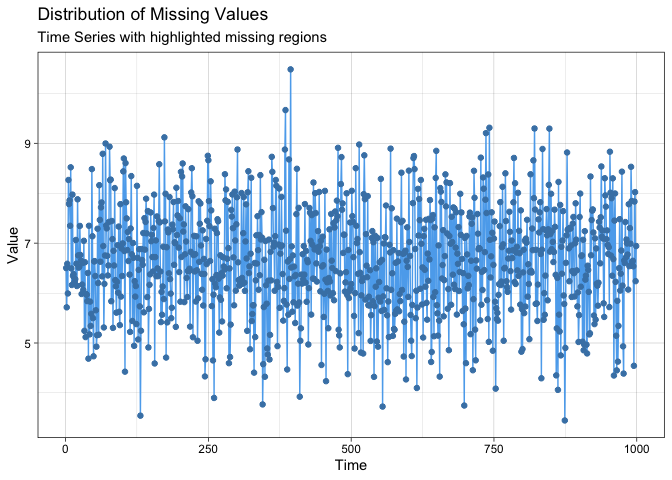
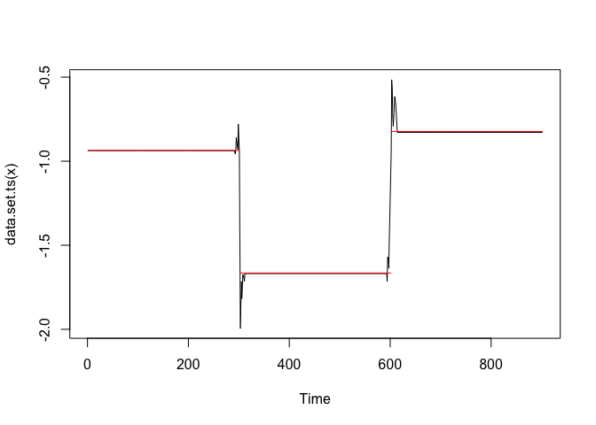

<!-- README.md is generated from README.Rmd. Please edit that file -->

# ssmimputedemo

<!-- badges: start -->

[](https://travis-ci.com/Junzheshao5959/ssmimputedemo)
[](https://github.com/Junzheshao5959/ssmimputedemo/actions)
<!-- badges: end -->

Welcome!

The goal of ssmimputedemo is a testing package for the development of
SSMimpute method.

## Installation

You can install the development version of ssmimputedemo like so:

``` r
library(devtools)
devtools::install_github("Junzheshao5959/ssmimputedemo")
```

## Example

This is a basic example which shows you how to solve a common problem:

``` r
library(ssmimputedemo)
## basic example code
ssmimputedemo::hello("Apple")
#> [1] "Hello Apple, this is the word world!"
```

Here is a very basic example when possible change points are same across
variables. We considered the following model.  
*Y*<sub>*t*</sub> = *β*<sub>0, *t*</sub> + 0.5*Y*<sub>*t* − 1</sub> + *β*<sub>1, *t*</sub>*X*<sub>*t*</sub> − 0.5*X*<sub>*t* − 1</sub> − *β*<sub>*c*, *t*</sub>*C*<sub>*t*</sub> + *v*<sub>*t*</sub>,  *v*<sub>*t*</sub> ∼ *N*(0, 1)

where *β*<sub>0, *t*</sub> follows a random walk as
*β*<sub>0, *t*</sub> = 40 + *β*<sub>0, *t* − 1</sub> + *w*<sub>*t*</sub>
and *w*<sub>*t*</sub> ∼ *N*(0, 0.25), and *β*<sub>*c*, *t*</sub> =  − 1
for *t* = 1, …, 400, *β*<sub>*c*, *t*</sub> =  − 2 for
*t* = 401, …, 700, and *β*<sub>*c*, *t*</sub> = 0 for
*t* = 701, …, 1000.

Here are plots for the sample data set `data_space_SSMimpute`


``` r
?data_space_SSMimpute
?run.SSMimpute_unanimous_cpts
kable(head(data_space_SSMimpute))
```

|   X | Date       |        y |         x |        c |     y\_1 |      x\_1 |     c\_1 |
|----:|:-----------|---------:|----------:|---------:|---------:|----------:|---------:|
|   2 | 2019-02-13 |       NA | 10.736508 | 6.501732 | 44.39751 |  7.626688 | 5.838465 |
|   3 | 2019-02-14 |       NA |  8.511424 | 5.714511 |       NA | 10.736508 | 6.501732 |
|   4 | 2019-02-15 |       NA |  7.149594 | 6.586657 |       NA |  8.511424 | 5.714511 |
|   5 | 2019-02-16 | 42.84296 |  9.272445 | 5.992080 |       NA |  7.149594 | 6.586657 |
|   6 | 2019-02-17 | 39.27642 | 10.543667 | 8.265307 | 42.84296 |  9.272445 | 5.992080 |
|   7 | 2019-02-18 |       NA | 10.075845 | 7.783034 | 39.27642 | 10.543667 | 8.265307 |

``` r
imputeTS::ggplot_na_distribution(data_space_SSMimpute$y, color_missing = "pink",color_missing_border = "pink", alpha_missing = 0.9)
```


``` r
imputeTS::ggplot_na_distribution(data_space_SSMimpute$x, color_missing = "pink",color_missing_border = "pink", alpha_missing = 0.9)
```



``` r
imputeTS::ggplot_na_distribution(data_space_SSMimpute$c, color_missing = "pink",color_missing_border = "pink", alpha_missing = 0.9)
```



``` r
printFlag=T
formula="y~y_1+x+x_1+c"
formula_var=unlist(strsplit(unlist(strsplit(formula,"~"))[2],"+",fixed=T))

ss_param=list(inits=c(log(0.25),log(1)),m0=c(40,0.5,-1,-0.5,-1),C0=diag(rep(10^3),5), AR1_coeffi=NULL,rw_coeffi="intercept", v_cp_param=NULL, w_cp_param=list(list(variable="x","segments"=3,"changepoints"=c(400,700),fixed_cpts=F),list(variable="c","segments"=3,"changepoints"=c(400,700),fixed_cpts=F)),max_iteration=100)

head(data_space_SSMimpute)

result_statespace_SSMimpute1=run.SSMimpute_unanimous_cpts(data_ss_ori=data_space_SSMimpute,formula_var,ss_param_temp=ss_param,
                                                         initial_imputation_option="StructTS",
                                                         estimate_convergence_cri=0.01,
                                                         lik_convergence_cri=0.01,
                                                         stepsize_for_newpart=1/3,
                                                         max_iteration=100,
                                                         cpt_learning_param=list(cpt_method="mean",burnin=1/10,mergeband=20,convergence_cri=10),
                                                         cpt_initial_guess_option="ignore",
                                                         dlm_option="smooth",m=5,seed=1,printFlag=F)
#> Warning in BINSEG(sumstat, pen = pen.value, cost_func = costfunc, minseglen
#> = minseglen, : The number of changepoints identified is Q, it is advised to
#> increase Q to make sure changepoints have not been missed.

#> Warning in BINSEG(sumstat, pen = pen.value, cost_func = costfunc, minseglen
#> = minseglen, : The number of changepoints identified is Q, it is advised to
#> increase Q to make sure changepoints have not been missed.

#> Warning in BINSEG(sumstat, pen = pen.value, cost_func = costfunc, minseglen
#> = minseglen, : The number of changepoints identified is Q, it is advised to
#> increase Q to make sure changepoints have not been missed.

#> Warning in BINSEG(sumstat, pen = pen.value, cost_func = costfunc, minseglen
#> = minseglen, : The number of changepoints identified is Q, it is advised to
#> increase Q to make sure changepoints have not been missed.

#> Warning in BINSEG(sumstat, pen = pen.value, cost_func = costfunc, minseglen
#> = minseglen, : The number of changepoints identified is Q, it is advised to
#> increase Q to make sure changepoints have not been missed.

#> Warning in BINSEG(sumstat, pen = pen.value, cost_func = costfunc, minseglen
#> = minseglen, : The number of changepoints identified is Q, it is advised to
#> increase Q to make sure changepoints have not been missed.

#> Warning in BINSEG(sumstat, pen = pen.value, cost_func = costfunc, minseglen
#> = minseglen, : The number of changepoints identified is Q, it is advised to
#> increase Q to make sure changepoints have not been missed.

#> Warning in BINSEG(sumstat, pen = pen.value, cost_func = costfunc, minseglen
#> = minseglen, : The number of changepoints identified is Q, it is advised to
#> increase Q to make sure changepoints have not been missed.

#> Warning in BINSEG(sumstat, pen = pen.value, cost_func = costfunc, minseglen
#> = minseglen, : The number of changepoints identified is Q, it is advised to
#> increase Q to make sure changepoints have not been missed.

#> Warning in BINSEG(sumstat, pen = pen.value, cost_func = costfunc, minseglen
#> = minseglen, : The number of changepoints identified is Q, it is advised to
#> increase Q to make sure changepoints have not been missed.

#> Warning in BINSEG(sumstat, pen = pen.value, cost_func = costfunc, minseglen
#> = minseglen, : The number of changepoints identified is Q, it is advised to
#> increase Q to make sure changepoints have not been missed.

#> Warning in BINSEG(sumstat, pen = pen.value, cost_func = costfunc, minseglen
#> = minseglen, : The number of changepoints identified is Q, it is advised to
#> increase Q to make sure changepoints have not been missed.

#> Warning in BINSEG(sumstat, pen = pen.value, cost_func = costfunc, minseglen
#> = minseglen, : The number of changepoints identified is Q, it is advised to
#> increase Q to make sure changepoints have not been missed.

#> Warning in BINSEG(sumstat, pen = pen.value, cost_func = costfunc, minseglen
#> = minseglen, : The number of changepoints identified is Q, it is advised to
#> increase Q to make sure changepoints have not been missed.

#> Warning in BINSEG(sumstat, pen = pen.value, cost_func = costfunc, minseglen
#> = minseglen, : The number of changepoints identified is Q, it is advised to
#> increase Q to make sure changepoints have not been missed.

#> Warning in BINSEG(sumstat, pen = pen.value, cost_func = costfunc, minseglen
#> = minseglen, : The number of changepoints identified is Q, it is advised to
#> increase Q to make sure changepoints have not been missed.

#> Warning in BINSEG(sumstat, pen = pen.value, cost_func = costfunc, minseglen
#> = minseglen, : The number of changepoints identified is Q, it is advised to
#> increase Q to make sure changepoints have not been missed.

#> Warning in BINSEG(sumstat, pen = pen.value, cost_func = costfunc, minseglen
#> = minseglen, : The number of changepoints identified is Q, it is advised to
#> increase Q to make sure changepoints have not been missed.

#> Warning in BINSEG(sumstat, pen = pen.value, cost_func = costfunc, minseglen
#> = minseglen, : The number of changepoints identified is Q, it is advised to
#> increase Q to make sure changepoints have not been missed.

#> Warning in BINSEG(sumstat, pen = pen.value, cost_func = costfunc, minseglen
#> = minseglen, : The number of changepoints identified is Q, it is advised to
#> increase Q to make sure changepoints have not been missed.

#> Warning in BINSEG(sumstat, pen = pen.value, cost_func = costfunc, minseglen
#> = minseglen, : The number of changepoints identified is Q, it is advised to
#> increase Q to make sure changepoints have not been missed.

#> Warning in BINSEG(sumstat, pen = pen.value, cost_func = costfunc, minseglen
#> = minseglen, : The number of changepoints identified is Q, it is advised to
#> increase Q to make sure changepoints have not been missed.

#> Warning in BINSEG(sumstat, pen = pen.value, cost_func = costfunc, minseglen
#> = minseglen, : The number of changepoints identified is Q, it is advised to
#> increase Q to make sure changepoints have not been missed.

#> Warning in BINSEG(sumstat, pen = pen.value, cost_func = costfunc, minseglen
#> = minseglen, : The number of changepoints identified is Q, it is advised to
#> increase Q to make sure changepoints have not been missed.

#> Warning in BINSEG(sumstat, pen = pen.value, cost_func = costfunc, minseglen
#> = minseglen, : The number of changepoints identified is Q, it is advised to
#> increase Q to make sure changepoints have not been missed.

#> Warning in BINSEG(sumstat, pen = pen.value, cost_func = costfunc, minseglen
#> = minseglen, : The number of changepoints identified is Q, it is advised to
#> increase Q to make sure changepoints have not been missed.

#> Warning in BINSEG(sumstat, pen = pen.value, cost_func = costfunc, minseglen
#> = minseglen, : The number of changepoints identified is Q, it is advised to
#> increase Q to make sure changepoints have not been missed.

#> Warning in BINSEG(sumstat, pen = pen.value, cost_func = costfunc, minseglen
#> = minseglen, : The number of changepoints identified is Q, it is advised to
#> increase Q to make sure changepoints have not been missed.

#> Warning in BINSEG(sumstat, pen = pen.value, cost_func = costfunc, minseglen
#> = minseglen, : The number of changepoints identified is Q, it is advised to
#> increase Q to make sure changepoints have not been missed.

#> Warning in BINSEG(sumstat, pen = pen.value, cost_func = costfunc, minseglen
#> = minseglen, : The number of changepoints identified is Q, it is advised to
#> increase Q to make sure changepoints have not been missed.

#> Warning in BINSEG(sumstat, pen = pen.value, cost_func = costfunc, minseglen
#> = minseglen, : The number of changepoints identified is Q, it is advised to
#> increase Q to make sure changepoints have not been missed.

#> Warning in BINSEG(sumstat, pen = pen.value, cost_func = costfunc, minseglen
#> = minseglen, : The number of changepoints identified is Q, it is advised to
#> increase Q to make sure changepoints have not been missed.

#> Warning in BINSEG(sumstat, pen = pen.value, cost_func = costfunc, minseglen
#> = minseglen, : The number of changepoints identified is Q, it is advised to
#> increase Q to make sure changepoints have not been missed.

#> Warning in BINSEG(sumstat, pen = pen.value, cost_func = costfunc, minseglen
#> = minseglen, : The number of changepoints identified is Q, it is advised to
#> increase Q to make sure changepoints have not been missed.

#> Warning in BINSEG(sumstat, pen = pen.value, cost_func = costfunc, minseglen
#> = minseglen, : The number of changepoints identified is Q, it is advised to
#> increase Q to make sure changepoints have not been missed.

#> Warning in BINSEG(sumstat, pen = pen.value, cost_func = costfunc, minseglen
#> = minseglen, : The number of changepoints identified is Q, it is advised to
#> increase Q to make sure changepoints have not been missed.

#> Warning in BINSEG(sumstat, pen = pen.value, cost_func = costfunc, minseglen
#> = minseglen, : The number of changepoints identified is Q, it is advised to
#> increase Q to make sure changepoints have not been missed.

#> Warning in BINSEG(sumstat, pen = pen.value, cost_func = costfunc, minseglen
#> = minseglen, : The number of changepoints identified is Q, it is advised to
#> increase Q to make sure changepoints have not been missed.

#> Warning in BINSEG(sumstat, pen = pen.value, cost_func = costfunc, minseglen
#> = minseglen, : The number of changepoints identified is Q, it is advised to
#> increase Q to make sure changepoints have not been missed.

#> Warning in BINSEG(sumstat, pen = pen.value, cost_func = costfunc, minseglen
#> = minseglen, : The number of changepoints identified is Q, it is advised to
#> increase Q to make sure changepoints have not been missed.

#> Warning in BINSEG(sumstat, pen = pen.value, cost_func = costfunc, minseglen
#> = minseglen, : The number of changepoints identified is Q, it is advised to
#> increase Q to make sure changepoints have not been missed.

#> Warning in BINSEG(sumstat, pen = pen.value, cost_func = costfunc, minseglen
#> = minseglen, : The number of changepoints identified is Q, it is advised to
#> increase Q to make sure changepoints have not been missed.

#> Warning in BINSEG(sumstat, pen = pen.value, cost_func = costfunc, minseglen
#> = minseglen, : The number of changepoints identified is Q, it is advised to
#> increase Q to make sure changepoints have not been missed.

#> Warning in BINSEG(sumstat, pen = pen.value, cost_func = costfunc, minseglen
#> = minseglen, : The number of changepoints identified is Q, it is advised to
#> increase Q to make sure changepoints have not been missed.

#> Warning in BINSEG(sumstat, pen = pen.value, cost_func = costfunc, minseglen
#> = minseglen, : The number of changepoints identified is Q, it is advised to
#> increase Q to make sure changepoints have not been missed.

#> Warning in BINSEG(sumstat, pen = pen.value, cost_func = costfunc, minseglen
#> = minseglen, : The number of changepoints identified is Q, it is advised to
#> increase Q to make sure changepoints have not been missed.

#> Warning in BINSEG(sumstat, pen = pen.value, cost_func = costfunc, minseglen
#> = minseglen, : The number of changepoints identified is Q, it is advised to
#> increase Q to make sure changepoints have not been missed.

#> Warning in BINSEG(sumstat, pen = pen.value, cost_func = costfunc, minseglen
#> = minseglen, : The number of changepoints identified is Q, it is advised to
#> increase Q to make sure changepoints have not been missed.

#> Warning in BINSEG(sumstat, pen = pen.value, cost_func = costfunc, minseglen
#> = minseglen, : The number of changepoints identified is Q, it is advised to
#> increase Q to make sure changepoints have not been missed.

#> Warning in BINSEG(sumstat, pen = pen.value, cost_func = costfunc, minseglen
#> = minseglen, : The number of changepoints identified is Q, it is advised to
#> increase Q to make sure changepoints have not been missed.

#> Warning in BINSEG(sumstat, pen = pen.value, cost_func = costfunc, minseglen
#> = minseglen, : The number of changepoints identified is Q, it is advised to
#> increase Q to make sure changepoints have not been missed.

#> Warning in BINSEG(sumstat, pen = pen.value, cost_func = costfunc, minseglen
#> = minseglen, : The number of changepoints identified is Q, it is advised to
#> increase Q to make sure changepoints have not been missed.

#> Warning in BINSEG(sumstat, pen = pen.value, cost_func = costfunc, minseglen
#> = minseglen, : The number of changepoints identified is Q, it is advised to
#> increase Q to make sure changepoints have not been missed.

#> Warning in BINSEG(sumstat, pen = pen.value, cost_func = costfunc, minseglen
#> = minseglen, : The number of changepoints identified is Q, it is advised to
#> increase Q to make sure changepoints have not been missed.

#> Warning in BINSEG(sumstat, pen = pen.value, cost_func = costfunc, minseglen
#> = minseglen, : The number of changepoints identified is Q, it is advised to
#> increase Q to make sure changepoints have not been missed.

#> Warning in BINSEG(sumstat, pen = pen.value, cost_func = costfunc, minseglen
#> = minseglen, : The number of changepoints identified is Q, it is advised to
#> increase Q to make sure changepoints have not been missed.

#> Warning in BINSEG(sumstat, pen = pen.value, cost_func = costfunc, minseglen
#> = minseglen, : The number of changepoints identified is Q, it is advised to
#> increase Q to make sure changepoints have not been missed.

#> Warning in BINSEG(sumstat, pen = pen.value, cost_func = costfunc, minseglen
#> = minseglen, : The number of changepoints identified is Q, it is advised to
#> increase Q to make sure changepoints have not been missed.
```

``` r
#kable(result_statespace_SSMimpute1$result_convergence)
#kable(result_statespace_SSMimpute1$result_convergence_mp)
kable(result_statespace_SSMimpute1$result_convergence_mp_addV)
```

|             |   Estimate | Std.Error |
|:------------|-----------:|----------:|
| (Intercept) | 37.0893470 | 2.5694929 |
| y\_1        |  0.4907345 | 0.0238453 |
| x(period1)  | -1.1081282 | 0.1114787 |
| x(period2)  | -2.1127099 | 0.1092351 |
| x(period3)  | -0.9472562 | 0.1473329 |
| x\_1        | -0.4716870 | 0.1127635 |
| c(period1)  | -0.8982879 | 0.1383859 |
| c(period2)  | -1.8120645 | 0.1290675 |
| c(period3)  | -0.8992476 | 0.1113789 |

``` r
result_statespace_SSMimpute1$estimated_cpts
#> [1] 399 700
```
