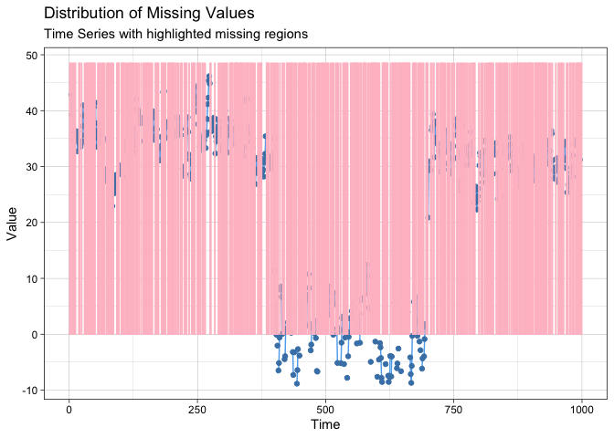
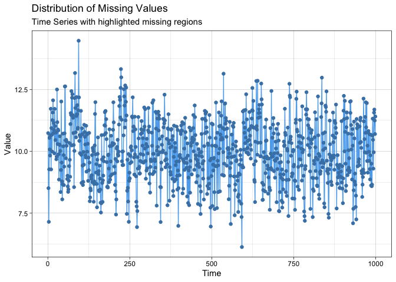

<!-- README.md is generated from README.Rmd. Please edit that file -->

# ssmimputedemo

<!-- badges: start -->

[](https://travis-ci.com/Junzheshao5959/ssmimputedemo)
[](https://github.com/Junzheshao5959/ssmimputedemo/actions)
<!-- badges: end -->

Welcome!

The goal of ssmimputedemo is a testing package for the development of
SSMimpute method.

## Installation

You can install the development version of ssmimputedemo like so:

``` r
library(devtools)
#> Loading required package: usethis
devtools::install_github("Junzheshao5959/ssmimputedemo")
#> Skipping install of 'ssmimputedemo' from a github remote, the SHA1 (3498fd17) has not changed since last install.
#>   Use `force = TRUE` to force installation
```

## Example

This is a basic example which shows you how to solve a common problem:

``` r
library(ssmimputedemo)
#> Loading required package: tibble
#> Loading required package: changepoint
#> Loading required package: zoo
#> 
#> Attaching package: 'zoo'
#> The following objects are masked from 'package:base':
#> 
#>     as.Date, as.Date.numeric
#> Successfully loaded changepoint package version 2.2.2
#>  NOTE: Predefined penalty values changed in version 2.2.  Previous penalty values with a postfix 1 i.e. SIC1 are now without i.e. SIC and previous penalties without a postfix i.e. SIC are now with a postfix 0 i.e. SIC0. See NEWS and help files for further details.
#> Loading required package: dlm
#> 
#> Attaching package: 'dlm'
#> The following object is masked from 'package:crayon':
#> 
#>     %+%
#> Loading required package: tidyverse
#> ── Attaching packages ─────────────────────────────────────── tidyverse 1.3.1 ──
#> ✓ ggplot2 3.3.5     ✓ dplyr   1.0.7
#> ✓ tidyr   1.1.4     ✓ stringr 1.4.0
#> ✓ readr   2.1.1     ✓ forcats 0.5.1
#> ✓ purrr   0.3.4
#> ── Conflicts ────────────────────────────────────────── tidyverse_conflicts() ──
#> x ggplot2::%+%()  masks dlm::%+%(), crayon::%+%()
#> x dplyr::filter() masks stats::filter()
#> x dplyr::lag()    masks stats::lag()
#> x dplyr::select() masks MASS::select()
#> Loading required package: imputeTS
#> Registered S3 method overwritten by 'quantmod':
#>   method            from
#>   as.zoo.data.frame zoo
#> 
#> Attaching package: 'imputeTS'
#> The following object is masked from 'package:zoo':
#> 
#>     na.locf
#> Warning: replacing previous import 'crayon::%+%' by 'dlm::%+%' when loading
#> 'ssmimputedemo'
#> Warning: replacing previous import 'MASS::select' by 'dplyr::select' when
#> loading 'ssmimputedemo'
## basic example code
ssmimputedemo::hello("world")
#> [1] "Hello world, this is the word world!"
```

Check the functions and dataset here:

``` r
?data_space_SSMimpute
?run.SSMimpute_unanimous_cpts
kable(head(data_space_SSMimpute))
```

|   X | Date       |        y |         x |        c |     y\_1 |      x\_1 |     c\_1 |
|----:|:-----------|---------:|----------:|---------:|---------:|----------:|---------:|
|   2 | 2019-02-13 |       NA | 10.736508 | 6.501732 | 44.39751 |  7.626688 | 5.838465 |
|   3 | 2019-02-14 |       NA |  8.511424 | 5.714511 |       NA | 10.736508 | 6.501732 |
|   4 | 2019-02-15 |       NA |  7.149594 | 6.586657 |       NA |  8.511424 | 5.714511 |
|   5 | 2019-02-16 | 42.84296 |  9.272445 | 5.992080 |       NA |  7.149594 | 6.586657 |
|   6 | 2019-02-17 | 39.27642 | 10.543667 | 8.265307 | 42.84296 |  9.272445 | 5.992080 |
|   7 | 2019-02-18 |       NA | 10.075845 | 7.783034 | 39.27642 | 10.543667 | 8.265307 |

``` r
imputeTS::ggplot_na_distribution(data_space_SSMimpute$y, color_missing = "pink",color_missing_border = "pink", alpha_missing = 0.9)
```



``` r
imputeTS::ggplot_na_distribution(data_space_SSMimpute$x, color_missing = "pink",color_missing_border = "pink", alpha_missing = 0.9)
```



Here is a very basic example when possible change points are same across
variables

    #>   X       Date        y         x        c      y_1       x_1      c_1
    #> 1 2 2019-02-13       NA 10.736508 6.501732 44.39751  7.626688 5.838465
    #> 2 3 2019-02-14       NA  8.511424 5.714511       NA 10.736508 6.501732
    #> 3 4 2019-02-15       NA  7.149594 6.586657       NA  8.511424 5.714511
    #> 4 5 2019-02-16 42.84296  9.272445 5.992080       NA  7.149594 6.586657
    #> 5 6 2019-02-17 39.27642 10.543667 8.265307 42.84296  9.272445 5.992080
    #> 6 7 2019-02-18       NA 10.075845 7.783034 39.27642 10.543667 8.265307
    #> Note: ''changepoints'' of W is given a initial guess, but need to be updated according to the fitting result.
    #> The changepoints are not all fixed, and need to be updated.
    #> Warning in BINSEG(sumstat, pen = pen.value, cost_func = costfunc, minseglen
    #> = minseglen, : The number of changepoints identified is Q, it is advised to
    #> increase Q to make sure changepoints have not been missed.

    #> Warning in BINSEG(sumstat, pen = pen.value, cost_func = costfunc, minseglen
    #> = minseglen, : The number of changepoints identified is Q, it is advised to
    #> increase Q to make sure changepoints have not been missed.
    #> The changepoints are: 400 702 ; changepoint convergence is TRUE 
    #> i=1
    #> likelihood: 487.5552 
    #> Estimate: 30.94004 0.6093355 -0.8586126 -1.613339 -0.7587319 -0.545232 -0.7644105 -1.499062 -0.7139168 
    #> Std.Error: 1.437974 0.02048966 0.09064807 4.473118 0.08161007 0.06252536 0.08337286 4.473225 0.09410379 
    #> The changepoints are not all fixed, and need to be updated.
    #> Warning in BINSEG(sumstat, pen = pen.value, cost_func = costfunc, minseglen
    #> = minseglen, : The number of changepoints identified is Q, it is advised to
    #> increase Q to make sure changepoints have not been missed.

    #> Warning in BINSEG(sumstat, pen = pen.value, cost_func = costfunc, minseglen
    #> = minseglen, : The number of changepoints identified is Q, it is advised to
    #> increase Q to make sure changepoints have not been missed.
    #> The changepoints are: 400 702 ; changepoint convergence is TRUE 
    #> i=2
    #> likelihood: 485.8369 
    #> Estimate: 31.52225 0.6024681 -0.9372688 -1.668564 -0.8285003 -0.4753108 -0.8076595 -1.547974 -0.7649317 
    #> Std.Error: 1.453284 0.02043344 0.08997025 0.0919521 0.08186892 0.06346528 0.08258081 0.09777285 0.09426038 
    #> The changepoints are not all fixed, and need to be updated.
    #> Warning in BINSEG(sumstat, pen = pen.value, cost_func = costfunc, minseglen
    #> = minseglen, : The number of changepoints identified is Q, it is advised to
    #> increase Q to make sure changepoints have not been missed.

    #> Warning in BINSEG(sumstat, pen = pen.value, cost_func = costfunc, minseglen
    #> = minseglen, : The number of changepoints identified is Q, it is advised to
    #> increase Q to make sure changepoints have not been missed.
    #> The changepoints are: 400 702 ; changepoint convergence is TRUE 
    #> i=3
    #> likelihood: 488.3624 
    #> Estimate: 32.29845 0.5898527 -0.9922455 -1.75992 -0.8744846 -0.4399498 -0.8369692 -1.604315 -0.8052181 
    #> Std.Error: 1.475525 0.02039999 0.09021584 0.09147528 0.08278487 0.06449663 0.08268061 0.09789813 0.09520443 
    #> The changepoints are not all fixed, and need to be updated.
    #> Warning in BINSEG(sumstat, pen = pen.value, cost_func = costfunc, minseglen
    #> = minseglen, : The number of changepoints identified is Q, it is advised to
    #> increase Q to make sure changepoints have not been missed.

    #> Warning in BINSEG(sumstat, pen = pen.value, cost_func = costfunc, minseglen
    #> = minseglen, : The number of changepoints identified is Q, it is advised to
    #> increase Q to make sure changepoints have not been missed.
    #> The changepoints are: 400 700 ; changepoint convergence is TRUE 
    #> i=4
    #> likelihood: 491.336 
    #> Estimate: 32.97079 0.5779239 -1.029917 -1.830047 -0.9054598 -0.4205036 -0.8566146 -1.648264 -0.8352174 
    #> Std.Error: 1.493455 0.02033848 0.09064604 0.09140643 0.08365923 0.0653311 0.08297888 0.09824577 0.09612044 
    #> The changepoints are not all fixed, and need to be updated.
    #> Warning in BINSEG(sumstat, pen = pen.value, cost_func = costfunc, minseglen
    #> = minseglen, : The number of changepoints identified is Q, it is advised to
    #> increase Q to make sure changepoints have not been missed.

    #> Warning in BINSEG(sumstat, pen = pen.value, cost_func = costfunc, minseglen
    #> = minseglen, : The number of changepoints identified is Q, it is advised to
    #> increase Q to make sure changepoints have not been missed.
    #> The changepoints are: 400 700 ; changepoint convergence is TRUE 
    #> i=5
    #> likelihood: 493.796 
    #> Estimate: 33.49209 0.5681799 -1.055684 -1.881979 -0.9267194 -0.4090491 -0.8699414 -1.680968 -0.8571371 
    #> Std.Error: 1.505875 0.02026015 0.09104979 0.09145218 0.0843467 0.06595068 0.08327427 0.09858516 0.09683886 
    #> The changepoints are not all fixed, and need to be updated.
    #> Warning in BINSEG(sumstat, pen = pen.value, cost_func = costfunc, minseglen
    #> = minseglen, : The number of changepoints identified is Q, it is advised to
    #> increase Q to make sure changepoints have not been missed.

    #> Warning in BINSEG(sumstat, pen = pen.value, cost_func = costfunc, minseglen
    #> = minseglen, : The number of changepoints identified is Q, it is advised to
    #> increase Q to make sure changepoints have not been missed.
    #> The changepoints are: 400 700 ; changepoint convergence is TRUE 
    #> i=6
    #> likelihood: 495.4549 
    #> Estimate: 33.86069 0.5608674 -1.073655 -1.920032 -0.9414366 -0.4014192 -0.8791865 -1.704891 -0.8721622 
    #> Std.Error: 1.513521 0.02017296 0.09133401 0.0914731 0.08481289 0.06636973 0.0834773 0.09881432 0.09731878 
    #> The changepoints are not all fixed, and need to be updated.
    #> Warning in BINSEG(sumstat, pen = pen.value, cost_func = costfunc, minseglen
    #> = minseglen, : The number of changepoints identified is Q, it is advised to
    #> increase Q to make sure changepoints have not been missed.

    #> Warning in BINSEG(sumstat, pen = pen.value, cost_func = costfunc, minseglen
    #> = minseglen, : The number of changepoints identified is Q, it is advised to
    #> increase Q to make sure changepoints have not been missed.
    #> The changepoints are: 400 700 ; changepoint convergence is TRUE 
    #> i=7
    #> likelihood: 496.596 
    #> Estimate: 34.12778 0.5553727 -1.08615 -1.947922 -0.9517228 -0.3963921 -0.8855817 -1.722217 -0.8828088 
    #> Std.Error: 1.518234 0.02009205 0.09153873 0.09148333 0.0851351 0.06665638 0.08362141 0.09897508 0.0976472 
    #> The changepoints are not all fixed, and need to be updated.
    #> Warning in BINSEG(sumstat, pen = pen.value, cost_func = costfunc, minseglen
    #> = minseglen, : The number of changepoints identified is Q, it is advised to
    #> increase Q to make sure changepoints have not been missed.

    #> Warning in BINSEG(sumstat, pen = pen.value, cost_func = costfunc, minseglen
    #> = minseglen, : The number of changepoints identified is Q, it is advised to
    #> increase Q to make sure changepoints have not been missed.
    #> The changepoints are: 399 700 ; changepoint convergence is TRUE 
    #> i=8
    #> likelihood: 497.3631 
    #> Estimate: 34.32236 0.551265 -1.094861 -1.968419 -0.9589357 -0.3930584 -0.8899828 -1.734704 -0.8904061 
    #> Std.Error: 1.521105 0.02002153 0.09168594 0.09148219 0.08535497 0.06684916 0.08372013 0.09908319 0.09786949 
    #> The changepoints are not all fixed, and need to be updated.
    #> Warning in BINSEG(sumstat, pen = pen.value, cost_func = costfunc, minseglen
    #> = minseglen, : The number of changepoints identified is Q, it is advised to
    #> increase Q to make sure changepoints have not been missed.

    #> Warning in BINSEG(sumstat, pen = pen.value, cost_func = costfunc, minseglen
    #> = minseglen, : The number of changepoints identified is Q, it is advised to
    #> increase Q to make sure changepoints have not been missed.
    #> The changepoints are: 399 700 ; changepoint convergence is TRUE 
    #> i=9
    #> likelihood: 498.0563 
    #> Estimate: 34.43251 0.5497862 -1.098647 -1.985933 -0.9664668 -0.3889992 -0.8917387 -1.74379 -0.8981112 
    #> Std.Error: 1.521526 0.0199219 0.09184378 0.09147061 0.08556088 0.06711641 0.0838413 0.09928398 0.09801794 
    #> The changepoints are not all fixed, and need to be updated.
    #> Warning in BINSEG(sumstat, pen = pen.value, cost_func = costfunc, minseglen
    #> = minseglen, : The number of changepoints identified is Q, it is advised to
    #> increase Q to make sure changepoints have not been missed.

    #> Warning in BINSEG(sumstat, pen = pen.value, cost_func = costfunc, minseglen
    #> = minseglen, : The number of changepoints identified is Q, it is advised to
    #> increase Q to make sure changepoints have not been missed.
    #> The changepoints are: 399 700 ; changepoint convergence is TRUE 
    #> i=10
    #> likelihood: 498.4464 
    #> Estimate: 34.54591 0.5473359 -1.103019 -1.997325 -0.9698508 -0.3878761 -0.8937729 -1.750368 -0.9020829 
    #> Std.Error: 1.522888 0.01987321 0.09191709 0.09147192 0.08567326 0.06720261 0.08389118 0.09934099 0.09813381 
    #> The changepoints are not all fixed, and need to be updated.
    #> Warning in BINSEG(sumstat, pen = pen.value, cost_func = costfunc, minseglen
    #> = minseglen, : The number of changepoints identified is Q, it is advised to
    #> increase Q to make sure changepoints have not been missed.

    #> Warning in BINSEG(sumstat, pen = pen.value, cost_func = costfunc, minseglen
    #> = minseglen, : The number of changepoints identified is Q, it is advised to
    #> increase Q to make sure changepoints have not been missed.
    #> The changepoints are: 399 700 ; changepoint convergence is TRUE 
    #> i=11
    #> likelihood: 498.6725 
    #> Estimate: 34.62968 0.5455132 -1.10612 -2.005751 -0.9722071 -0.3871605 -0.8951277 -1.755022 -0.9049532 
    #> Std.Error: 1.523686 0.0198325 0.09195908 0.09146271 0.08574399 0.06725293 0.08391718 0.09937109 0.09820649 
    #> The changepoints are not all fixed, and need to be updated.
    #> Warning in BINSEG(sumstat, pen = pen.value, cost_func = costfunc, minseglen
    #> = minseglen, : The number of changepoints identified is Q, it is advised to
    #> increase Q to make sure changepoints have not been missed.

    #> Warning in BINSEG(sumstat, pen = pen.value, cost_func = costfunc, minseglen
    #> = minseglen, : The number of changepoints identified is Q, it is advised to
    #> increase Q to make sure changepoints have not been missed.
    #> The changepoints are: 399 700 ; changepoint convergence is TRUE 
    #> i=12
    #> likelihood: 498.7859 
    #> Estimate: 34.69166 0.5441601 -1.108326 -2.011997 -0.9738442 -0.3867022 -0.8960096 -1.758288 -0.9070326 
    #> Std.Error: 1.524123 0.01979874 0.09197922 0.09144686 0.08578592 0.06727902 0.08392673 0.09938271 0.09824935 
    #> The changepoints are not all fixed, and need to be updated.
    #> Warning in BINSEG(sumstat, pen = pen.value, cost_func = costfunc, minseglen
    #> = minseglen, : The number of changepoints identified is Q, it is advised to
    #> increase Q to make sure changepoints have not been missed.

    #> Warning in BINSEG(sumstat, pen = pen.value, cost_func = costfunc, minseglen
    #> = minseglen, : The number of changepoints identified is Q, it is advised to
    #> increase Q to make sure changepoints have not been missed.
    #> The changepoints are: 399 700 ; changepoint convergence is TRUE 
    #> i=13
    #> likelihood: 498.8238 
    #> Estimate: 34.73748 0.5431581 -1.109899 -2.016636 -0.9749792 -0.3864041 -0.8965668 -1.760554 -0.9085422 
    #> Std.Error: 1.524331 0.0197709 0.09198461 0.09142727 0.08580825 0.06728919 0.08392536 0.0993821 0.09827191 
    #> The changepoints are not all fixed, and need to be updated.
    #> Warning in BINSEG(sumstat, pen = pen.value, cost_func = costfunc, minseglen
    #> = minseglen, : The number of changepoints identified is Q, it is advised to
    #> increase Q to make sure changepoints have not been missed.

    #> Warning in BINSEG(sumstat, pen = pen.value, cost_func = costfunc, minseglen
    #> = minseglen, : The number of changepoints identified is Q, it is advised to
    #> increase Q to make sure changepoints have not been missed.
    #> The changepoints are: 399 700 ; changepoint convergence is TRUE 
    #> i=14
    #> likelihood: 498.8132 
    #> Estimate: 34.7713 0.5424189 -1.111023 -2.020088 -0.9757645 -0.3862043 -0.8969045 -1.762102 -0.9096399 
    #> Std.Error: 1.524394 0.01974805 0.09198051 0.09140604 0.08581754 0.0672893 0.08391718 0.09937384 0.09828097 
    #> The changepoints are not all fixed, and need to be updated.
    #> Warning in BINSEG(sumstat, pen = pen.value, cost_func = costfunc, minseglen
    #> = minseglen, : The number of changepoints identified is Q, it is advised to
    #> increase Q to make sure changepoints have not been missed.

    #> Warning in BINSEG(sumstat, pen = pen.value, cost_func = costfunc, minseglen
    #> = minseglen, : The number of changepoints identified is Q, it is advised to
    #> increase Q to make sure changepoints have not been missed.
    #> The changepoints are: 399 700 ; changepoint convergence is TRUE 
    #> i=15
    #> likelihood: 498.7733 
    #> Estimate: 34.79617 0.5418756 -1.111827 -2.02266 -0.976307 -0.3860643 -0.8970968 -1.76314 -0.9104388 
    #> Std.Error: 1.524369 0.01972937 0.09197074 0.09138468 0.08581848 0.06728343 0.08390516 0.09936124 0.09828138 
    #> The changepoints are not all fixed, and need to be updated.
    #> Warning in BINSEG(sumstat, pen = pen.value, cost_func = costfunc, minseglen
    #> = minseglen, : The number of changepoints identified is Q, it is advised to
    #> increase Q to make sure changepoints have not been missed.

    #> Warning in BINSEG(sumstat, pen = pen.value, cost_func = costfunc, minseglen
    #> = minseglen, : The number of changepoints identified is Q, it is advised to
    #> increase Q to make sure changepoints have not been missed.
    #> The changepoints are: 399 700 ; changepoint convergence is TRUE 
    #> i=16
    #> likelihood: 498.7176 
    #> Estimate: 34.81438 0.5414783 -1.112403 -2.024578 -0.9766811 -0.3859607 -0.8971953 -1.763816 -0.9110208 
    #> Std.Error: 1.524294 0.01971417 0.09195801 0.09136422 0.08581437 0.06727437 0.08389139 0.09934663 0.09827655 
    #> The changepoints are not all fixed, and need to be updated.
    #> Warning in BINSEG(sumstat, pen = pen.value, cost_func = costfunc, minseglen
    #> = minseglen, : The number of changepoints identified is Q, it is advised to
    #> increase Q to make sure changepoints have not been missed.

    #> Warning in BINSEG(sumstat, pen = pen.value, cost_func = costfunc, minseglen
    #> = minseglen, : The number of changepoints identified is Q, it is advised to
    #> increase Q to make sure changepoints have not been missed.
    #> The changepoints are: 399 700 ; changepoint convergence is TRUE 
    #> i=17
    #> likelihood: 498.6554 
    #> Estimate: 34.82763 0.541189 -1.112816 -2.02601 -0.9769389 -0.3858796 -0.8972352 -1.764239 -0.9114448 
    #> Std.Error: 1.524193 0.01970186 0.09194418 0.09134531 0.08580748 0.06726398 0.08387728 0.09933158 0.09826886 
    #> The changepoints are not all fixed, and need to be updated.
    #> Warning in BINSEG(sumstat, pen = pen.value, cost_func = costfunc, minseglen
    #> = minseglen, : The number of changepoints identified is Q, it is advised to
    #> increase Q to make sure changepoints have not been missed.

    #> Warning in BINSEG(sumstat, pen = pen.value, cost_func = costfunc, minseglen
    #> = minseglen, : The number of changepoints identified is Q, it is advised to
    #> increase Q to make sure changepoints have not been missed.
    #> The changepoints are: 399 700 ; changepoint convergence is TRUE 
    #> i=18
    #> likelihood: 498.5929 
    #> Estimate: 34.83721 0.5409797 -1.113112 -2.027079 -0.9771164 -0.3858132 -0.8972401 -1.764488 -0.9117536 
    #> Std.Error: 1.524083 0.01969194 0.09193046 0.09132832 0.08579936 0.06725345 0.08386376 0.09931711 0.09825991 
    #> The changepoints are not all fixed, and need to be updated.
    #> Warning in BINSEG(sumstat, pen = pen.value, cost_func = costfunc, minseglen
    #> = minseglen, : The number of changepoints identified is Q, it is advised to
    #> increase Q to make sure changepoints have not been missed.

    #> Warning in BINSEG(sumstat, pen = pen.value, cost_func = costfunc, minseglen
    #> = minseglen, : The number of changepoints identified is Q, it is advised to
    #> increase Q to make sure changepoints have not been missed.
    #> The changepoints are: 399 700 ; changepoint convergence is TRUE 
    #> i=19
    #> likelihood: 498.5337 
    #> Estimate: 34.84409 0.540829 -1.113324 -2.027879 -0.9772386 -0.3857571 -0.8972255 -1.764619 -0.9119785 
    #> Std.Error: 1.523975 0.01968398 0.0919176 0.09131338 0.08579099 0.06724349 0.08385134 0.09930382 0.09825074 
    #> The changepoints are not all fixed, and need to be updated.
    #> Warning in BINSEG(sumstat, pen = pen.value, cost_func = costfunc, minseglen
    #> = minseglen, : The number of changepoints identified is Q, it is advised to
    #> increase Q to make sure changepoints have not been missed.

    #> Warning in BINSEG(sumstat, pen = pen.value, cost_func = costfunc, minseglen
    #> = minseglen, : The number of changepoints identified is Q, it is advised to
    #> increase Q to make sure changepoints have not been missed.
    #> The changepoints are: 399 700 ; changepoint convergence is TRUE 
    #> i=20
    #> likelihood: 498.4799 
    #> Estimate: 34.84897 0.5407212 -1.113475 -2.028478 -0.9773225 -0.3857088 -0.8972013 -1.764673 -0.9121419 
    #> Std.Error: 1.523874 0.01967763 0.091906 0.09130051 0.08578299 0.06723449 0.08384032 0.099292 0.09824199 
    #> The changepoints are not all fixed, and need to be updated.
    #> Warning in BINSEG(sumstat, pen = pen.value, cost_func = costfunc, minseglen
    #> = minseglen, : The number of changepoints identified is Q, it is advised to
    #> increase Q to make sure changepoints have not been missed.

    #> Warning in BINSEG(sumstat, pen = pen.value, cost_func = costfunc, minseglen
    #> = minseglen, : The number of changepoints identified is Q, it is advised to
    #> increase Q to make sure changepoints have not been missed.
    #> The changepoints are: 399 700 ; changepoint convergence is TRUE 
    #> i=21
    #> likelihood: 498.4327 
    #> Estimate: 34.85241 0.5406447 -1.113582 -2.028925 -0.9773802 -0.385667 -0.8971738 -1.764677 -0.9122605 
    #> Std.Error: 1.523783 0.0196726 0.09189584 0.0912896 0.0857757 0.06722662 0.08383076 0.09928177 0.09823402 
    #> The changepoints are not all fixed, and need to be updated.
    #> Warning in BINSEG(sumstat, pen = pen.value, cost_func = costfunc, minseglen
    #> = minseglen, : The number of changepoints identified is Q, it is advised to
    #> increase Q to make sure changepoints have not been missed.

    #> Warning in BINSEG(sumstat, pen = pen.value, cost_func = costfunc, minseglen
    #> = minseglen, : The number of changepoints identified is Q, it is advised to
    #> increase Q to make sure changepoints have not been missed.
    #> The changepoints are: 399 700 ; changepoint convergence is TRUE 
    #> i=22
    #> likelihood: 498.3921 
    #> Estimate: 34.85479 0.5405906 -1.113658 -2.02926 -0.9774198 -0.3856309 -0.8971466 -1.764652 -0.9123464 
    #> Std.Error: 1.523704 0.01966863 0.09188715 0.09128047 0.08576927 0.06721989 0.08382265 0.09927309 0.09822701 
    #> The changepoints are not all fixed, and need to be updated.
    #> Warning in BINSEG(sumstat, pen = pen.value, cost_func = costfunc, minseglen
    #> = minseglen, : The number of changepoints identified is Q, it is advised to
    #> increase Q to make sure changepoints have not been missed.

    #> Warning in BINSEG(sumstat, pen = pen.value, cost_func = costfunc, minseglen
    #> = minseglen, : The number of changepoints identified is Q, it is advised to
    #> increase Q to make sure changepoints have not been missed.
    #> The changepoints are: 399 700 ; changepoint convergence is TRUE 
    #> i=23
    #> likelihood: 498.3579 
    #> Estimate: 34.85643 0.5405528 -1.113711 -2.02951 -0.9774469 -0.3855999 -0.8971214 -1.76461 -0.9124083 
    #> Std.Error: 1.523637 0.01966551 0.09187984 0.09127295 0.08576375 0.06721427 0.08381587 0.09926586 0.09822098 
    #> The changepoints are not all fixed, and need to be updated.
    #> Warning in BINSEG(sumstat, pen = pen.value, cost_func = costfunc, minseglen
    #> = minseglen, : The number of changepoints identified is Q, it is advised to
    #> increase Q to make sure changepoints have not been missed.

    #> Warning in BINSEG(sumstat, pen = pen.value, cost_func = costfunc, minseglen
    #> = minseglen, : The number of changepoints identified is Q, it is advised to
    #> increase Q to make sure changepoints have not been missed.
    #> The changepoints are: 399 700 ; changepoint convergence is TRUE 
    #> i=24
    #> likelihood: 498.3295 
    #> Estimate: 34.85753 0.5405266 -1.113748 -2.029697 -0.9774654 -0.3855735 -0.8970994 -1.764562 -0.9124527 
    #> Std.Error: 1.52358 0.01966308 0.0918738 0.09126681 0.08575911 0.06720963 0.0838103 0.09925991 0.0982159 
    #> The changepoints are not all fixed, and need to be updated.
    #> Warning in BINSEG(sumstat, pen = pen.value, cost_func = costfunc, minseglen
    #> = minseglen, : The number of changepoints identified is Q, it is advised to
    #> increase Q to make sure changepoints have not been missed.

    #> Warning in BINSEG(sumstat, pen = pen.value, cost_func = costfunc, minseglen
    #> = minseglen, : The number of changepoints identified is Q, it is advised to
    #> increase Q to make sure changepoints have not been missed.
    #> The changepoints are: 399 700 ; changepoint convergence is TRUE 
    #> i=25
    #> likelihood: 498.3064 
    #> Estimate: 34.85825 0.5405085 -1.113774 -2.029836 -0.977478 -0.3855513 -0.8970806 -1.764512 -0.9124844 
    #> Std.Error: 1.523534 0.01966119 0.09186887 0.09126186 0.08575526 0.06720587 0.08380577 0.09925509 0.09821169 
    #> The changepoints are not all fixed, and need to be updated.
    #> Warning in BINSEG(sumstat, pen = pen.value, cost_func = costfunc, minseglen
    #> = minseglen, : The number of changepoints identified is Q, it is advised to
    #> increase Q to make sure changepoints have not been missed.

    #> Warning in BINSEG(sumstat, pen = pen.value, cost_func = costfunc, minseglen
    #> = minseglen, : The number of changepoints identified is Q, it is advised to
    #> increase Q to make sure changepoints have not been missed.
    #> The changepoints are: 399 700 ; changepoint convergence is TRUE 
    #> i=26
    #> likelihood: 498.2876 
    #> Estimate: 34.85871 0.5404962 -1.113791 -2.02994 -0.9774864 -0.3855327 -0.8970651 -1.764465 -0.9125068 
    #> Std.Error: 1.523496 0.01965974 0.0918649 0.0912579 0.08575213 0.06720286 0.08380214 0.09925123 0.09820826 
    #> The changepoints are not all fixed, and need to be updated.
    #> Warning in BINSEG(sumstat, pen = pen.value, cost_func = costfunc, minseglen
    #> = minseglen, : The number of changepoints identified is Q, it is advised to
    #> increase Q to make sure changepoints have not been missed.

    #> Warning in BINSEG(sumstat, pen = pen.value, cost_func = costfunc, minseglen
    #> = minseglen, : The number of changepoints identified is Q, it is advised to
    #> increase Q to make sure changepoints have not been missed.
    #> The changepoints are: 399 700 ; changepoint convergence is TRUE 
    #> i=27
    #> likelihood: 498.2727 
    #> Estimate: 34.85899 0.5404879 -1.113802 -2.030017 -0.9774921 -0.3855175 -0.8970524 -1.764422 -0.9125224 
    #> Std.Error: 1.523466 0.01965862 0.09186173 0.09125476 0.0857496 0.06720046 0.08379924 0.09924816 0.09820549 
    #> The changepoints are not all fixed, and need to be updated.
    #> Warning in BINSEG(sumstat, pen = pen.value, cost_func = costfunc, minseglen
    #> = minseglen, : The number of changepoints identified is Q, it is advised to
    #> increase Q to make sure changepoints have not been missed.

    #> Warning in BINSEG(sumstat, pen = pen.value, cost_func = costfunc, minseglen
    #> = minseglen, : The number of changepoints identified is Q, it is advised to
    #> increase Q to make sure changepoints have not been missed.
    #> The changepoints are: 399 700 ; changepoint convergence is TRUE 
    #> i=28
    #> likelihood: 498.2608 
    #> Estimate: 34.85916 0.5404824 -1.113809 -2.030073 -0.9774958 -0.385505 -0.8970422 -1.764383 -0.9125332 
    #> Std.Error: 1.523442 0.01965776 0.09185922 0.09125229 0.08574759 0.06719858 0.08379696 0.09924575 0.09820329 
    #> The changepoints are not all fixed, and need to be updated.
    #> Warning in BINSEG(sumstat, pen = pen.value, cost_func = costfunc, minseglen
    #> = minseglen, : The number of changepoints identified is Q, it is advised to
    #> increase Q to make sure changepoints have not been missed.

    #> Warning in BINSEG(sumstat, pen = pen.value, cost_func = costfunc, minseglen
    #> = minseglen, : The number of changepoints identified is Q, it is advised to
    #> increase Q to make sure changepoints have not been missed.
    #> The changepoints are: 399 700 ; changepoint convergence is TRUE 
    #> i=29
    #> likelihood: 498.2516 
    #> Estimate: 34.85924 0.5404788 -1.113814 -2.030115 -0.9774981 -0.385495 -0.8970342 -1.764351 -0.9125405 
    #> Std.Error: 1.523423 0.01965711 0.09185726 0.09125037 0.085746 0.06719711 0.08379518 0.09924387 0.09820154 
    #> seed for multiple imputation after SSMimpute is: 1 
    #> $`1`
    #>               Estimate  Std.Error
    #> (Intercept) 35.3494331 1.55852438
    #> y_1          0.5279469 0.01989110
    #> x(period1)  -1.0935397 0.09359701
    #> x(period2)  -2.0517124 0.09319332
    #> x(period3)  -0.9840937 0.08763118
    #> x_1         -0.4096755 0.06829847
    #> c(period1)  -0.9004207 0.08541198
    #> c(period2)  -1.7560565 0.10131370
    #> c(period3)  -0.9042799 0.10025973
    #> 
    #> $`2`
    #>               Estimate  Std.Error
    #> (Intercept) 34.9781898 1.52775778
    #> y_1          0.5326852 0.01954159
    #> x(period1)  -1.0964930 0.09237691
    #> x(period2)  -2.0307305 0.09180078
    #> x(period3)  -0.9423100 0.08602172
    #> x_1         -0.4100241 0.06719165
    #> c(period1)  -0.9051961 0.08431607
    #> c(period2)  -1.7590954 0.09989508
    #> c(period3)  -0.8992131 0.09873103
    #> 
    #> $`3`
    #>               Estimate  Std.Error
    #> (Intercept) 35.1963910 1.52606520
    #> y_1          0.5339083 0.01948983
    #> x(period1)  -1.1131393 0.09189022
    #> x(period2)  -2.0448502 0.09135054
    #> x(period3)  -0.9929768 0.08598390
    #> x_1         -0.3969935 0.06699045
    #> c(period1)  -0.8916398 0.08381473
    #> c(period2)  -1.7702974 0.09930860
    #> c(period3)  -0.8907550 0.09830810
    #> 
    #> $`4`
    #>               Estimate  Std.Error
    #> (Intercept) 35.1908849 1.55296904
    #> y_1          0.5319206 0.02003493
    #> x(period1)  -1.1113682 0.09395340
    #> x(period2)  -2.0481383 0.09320667
    #> x(period3)  -0.9784968 0.08769360
    #> x_1         -0.4051607 0.06862575
    #> c(period1)  -0.9060797 0.08567931
    #> c(period2)  -1.7627513 0.10151174
    #> c(period3)  -0.9183142 0.10038647
    #> 
    #> $`5`
    #>               Estimate  Std.Error
    #> (Intercept) 34.5799408 1.51315221
    #> y_1          0.5428249 0.01968663
    #> x(period1)  -1.1171434 0.09225347
    #> x(period2)  -2.0095130 0.09136385
    #> x(period3)  -0.9688488 0.08572039
    #> x_1         -0.3798004 0.06754602
    #> c(period1)  -0.8987684 0.08409871
    #> c(period2)  -1.7578108 0.09950457
    #> c(period3)  -0.9118140 0.09819002
    #> 
    #> seed for multiple imputation after SSMimpute is: 1 
    #> $`1`
    #>               Estimate  Std.Error
    #> (Intercept) 36.5937898 1.63301678
    #> y_1          0.4916423 0.01996472
    #> x(period1)  -1.1371721 0.09761071
    #> x(period2)  -2.1329270 0.09677856
    #> x(period3)  -0.9565793 0.09122414
    #> x_1         -0.4285867 0.07121218
    #> c(period1)  -0.8534171 0.08878967
    #> c(period2)  -1.7572239 0.10538904
    #> c(period3)  -0.8904292 0.10452329
    #> 
    #> $`2`
    #>               Estimate  Std.Error
    #> (Intercept) 35.7621112 1.61908241
    #> y_1          0.4982196 0.01993704
    #> x(period1)  -1.1060656 0.09709320
    #> x(period2)  -2.0763292 0.09639478
    #> x(period3)  -0.8808334 0.09012644
    #> x_1         -0.4681072 0.06996906
    #> c(period1)  -0.8854504 0.08845196
    #> c(period2)  -1.8038318 0.10476008
    #> c(period3)  -0.8935677 0.10384232
    #> 
    #> $`3`
    #>               Estimate  Std.Error
    #> (Intercept) 37.7630714 1.62080162
    #> y_1          0.4836374 0.01975057
    #> x(period1)  -1.0756721 0.09714843
    #> x(period2)  -2.1280758 0.09716962
    #> x(period3)  -0.9085994 0.09109279
    #> x_1         -0.5150712 0.06929647
    #> c(period1)  -0.8618838 0.08887467
    #> c(period2)  -1.8226255 0.10535239
    #> c(period3)  -0.9287471 0.10490173
    #> 
    #> $`4`
    #>               Estimate  Std.Error
    #> (Intercept) 37.3653425 1.63458686
    #> y_1          0.4939813 0.02017471
    #> x(period1)  -1.1259428 0.09737272
    #> x(period2)  -2.1192819 0.09725869
    #> x(period3)  -1.0112597 0.09183203
    #> x_1         -0.4367382 0.07099378
    #> c(period1)  -0.9717457 0.08870270
    #> c(period2)  -1.8383396 0.10516842
    #> c(period3)  -0.8971200 0.10474421
    #> 
    #> $`5`
    #>               Estimate  Std.Error
    #> (Intercept) 37.9624202 1.62099498
    #> y_1          0.4861918 0.02047982
    #> x(period1)  -1.0957885 0.10019174
    #> x(period2)  -2.1069358 0.09916043
    #> x(period3)  -0.9790091 0.09365719
    #> x_1         -0.5099319 0.07175402
    #> c(period1)  -0.9189424 0.09122725
    #> c(period2)  -1.8383015 0.10797037
    #> c(period3)  -0.8863738 0.10695435

``` r
kable(result_statespace_SSMimpute1$result_convergence)
```

|             |   Estimate | Std.Error |
|:------------|-----------:|----------:|
| (Intercept) | 34.8592438 | 1.5234230 |
| y\_1        |  0.5404788 | 0.0196571 |
| x(period1)  | -1.1138136 | 0.0918573 |
| x(period2)  | -2.0301153 | 0.0912504 |
| x(period3)  | -0.9774981 | 0.0857460 |
| x\_1        | -0.3854950 | 0.0671971 |
| c(period1)  | -0.8970342 | 0.0837952 |
| c(period2)  | -1.7643507 | 0.0992439 |
| c(period3)  | -0.9125405 | 0.0982015 |
