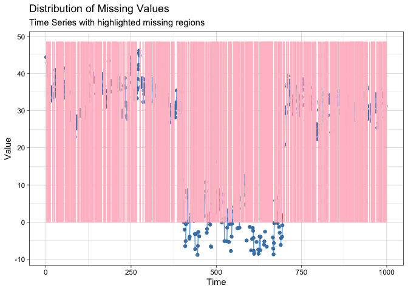
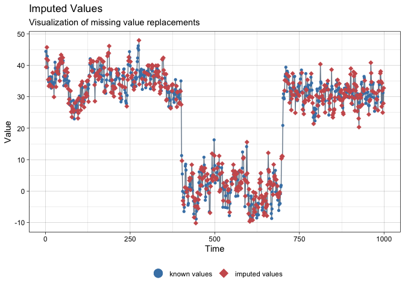

<!-- README.md is generated from README.Rmd. Please edit that file -->

# ssmimputedemo

<!-- badges: start -->

[](https://travis-ci.com/Junzheshao5959/ssmimputedemo)
[](https://github.com/Junzheshao5959/ssmimputedemo/actions)
<!-- badges: end -->

Welcome!

The goal of ssmimputedemo is a testing package for the development of
SSMimpute method.

## Installation

You can install the development version of ssmimputedemo like so:

``` r
library(devtools)
devtools::install_github("Junzheshao5959/ssmimputedemo")
```

## Example

This is a basic example which shows you how to solve a common problem:

``` r
library(ssmimputedemo)
## basic example code
ssmimputedemo::hello("John")
#> [1] "Hello John, this is the word world!"
```

Here is a very basic example when possible change points are same across
variables. We considered the following model.  

")

where

follows a random walk as

and
"),
and

for

for
,
and

for
.

Here are plots for the sample data set `data_space_SSMimpute`


``` r
?data_space_SSMimpute
?run.SSMimpute_unanimous_cpts
kable(head(data_space_SSMimpute))
```

|   X | Date       |        y |         x |        c |      y_1 |       x_1 |      c_1 |
|----:|:-----------|---------:|----------:|---------:|---------:|----------:|---------:|
|   2 | 2019-02-13 |       NA | 10.736508 | 6.501732 | 44.39751 |  7.626688 | 5.838465 |
|   3 | 2019-02-14 |       NA |  8.511424 | 5.714511 |       NA | 10.736508 | 6.501732 |
|   4 | 2019-02-15 |       NA |  7.149594 | 6.586657 |       NA |  8.511424 | 5.714511 |
|   5 | 2019-02-16 | 42.84296 |  9.272445 | 5.992080 |       NA |  7.149594 | 6.586657 |
|   6 | 2019-02-17 | 39.27642 | 10.543667 | 8.265307 | 42.84296 |  9.272445 | 5.992080 |
|   7 | 2019-02-18 |       NA | 10.075845 | 7.783034 | 39.27642 | 10.543667 | 8.265307 |

``` r

imputeTS::ggplot_na_distribution(data_space_SSMimpute$x, color_missing = "pink",color_missing_border = "pink", alpha_missing = 0.9)
```


``` r
imputeTS::ggplot_na_distribution(data_space_SSMimpute$c, color_missing = "pink",color_missing_border = "pink", alpha_missing = 0.9)
```


``` r
printFlag=T
formula="y~y_1+x+x_1"
formula_var=unlist(strsplit(unlist(strsplit(formula,"~"))[2],"+",fixed=T))

ss_param=list(inits=c(log(0.25),log(1)),m0=c(40,0.5,-1,-0.5),C0=diag(rep(10^3),4), AR1_coeffi=NULL,rw_coeffi="intercept", v_cp_param=NULL, w_cp_param=NULL,max_iteration=100)

head(data_space_SSMimpute)
#>   X       Date        y         x        c      y_1       x_1      c_1
#> 1 2 2019-02-13       NA 10.736508 6.501732 44.39751  7.626688 5.838465
#> 2 3 2019-02-14       NA  8.511424 5.714511       NA 10.736508 6.501732
#> 3 4 2019-02-15       NA  7.149594 6.586657       NA  8.511424 5.714511
#> 4 5 2019-02-16 42.84296  9.272445 5.992080       NA  7.149594 6.586657
#> 5 6 2019-02-17 39.27642 10.543667 8.265307 42.84296  9.272445 5.992080
#> 6 7 2019-02-18       NA 10.075845 7.783034 39.27642 10.543667 8.265307

result_statespace_SSMimpute1=run.SSMimpute_unanimous_cpts(data_ss_ori=data_space_SSMimpute,formula_var,ss_param_temp=ss_param,
                                                         initial_imputation_option="StructTS",
                                                         estimate_convergence_cri=0.01,
                                                         lik_convergence_cri=0.01,
                                                         stepsize_for_newpart=1/3,
                                                         max_iteration=100,
                                                         cpt_learning_param=list(cpt_method="mean",burnin=1/10,mergeband=20,convergence_cri=10),
                                                         cpt_initial_guess_option="ignore",
                                                         dlm_option="smooth",m=5,seed=1,printFlag=F)
#> i=1
#> likelihood: 599.6865 
#> Estimate: 11.50802 0.9224021 -0.8240836 -0.06272235 
#> Std.Error: 1.302007 0.01449277 0.08662031 0.08542098 
#> i=2
#> likelihood: 643.086 
#> Estimate: 15.19017 0.8667669 -0.9402658 -0.108151 
#> Std.Error: 1.670542 0.01980236 0.09337925 0.0943162 
#> i=3
#> likelihood: 671.694 
#> Estimate: 17.94212 0.8228725 -1.024819 -0.1448055 
#> Std.Error: 1.912696 0.02302308 0.09803325 0.1005104 
#> i=4
#> likelihood: 689.6551 
#> Estimate: 19.78734 0.7918821 -1.084523 -0.1662852 
#> Std.Error: 2.068062 0.02501043 0.1010643 0.1046612 
#> i=5
#> likelihood: 700.9777 
#> Estimate: 20.84098 0.7730751 -1.126201 -0.1720558 
#> Std.Error: 2.160356 0.02616847 0.1030884 0.1074778 
#> i=6
#> likelihood: 708.4168 
#> Estimate: 21.40282 0.762288 -1.155979 -0.1690884 
#> Std.Error: 2.214544 0.02684286 0.1045064 0.1094582 
#> i=7
#> likelihood: 713.5686 
#> Estimate: 21.73662 0.7554933 -1.177949 -0.1641011 
#> Std.Error: 2.249262 0.02727294 0.1055317 0.1108941 
#> i=8
#> likelihood: 717.2731 
#> Estimate: 21.98153 0.7504548 -1.194494 -0.1602539 
#> Std.Error: 2.274392 0.02758282 0.1062804 0.1119529 
#> i=9
#> likelihood: 719.9763 
#> Estimate: 22.18156 0.7464137 -1.20703 -0.1578969 
#> Std.Error: 2.293671 0.02781954 0.106827 0.1127375 
#> i=10
#> likelihood: 721.9491 
#> Estimate: 22.34438 0.7431953 -1.216519 -0.1564549 
#> Std.Error: 2.3084 0.02799978 0.1072248 0.1133179 
#> i=11
#> likelihood: 723.3805 
#> Estimate: 22.47339 0.7406976 -1.22369 -0.1554557 
#> Std.Error: 2.319431 0.02813445 0.1075129 0.1137453 
#> i=12
#> likelihood: 724.409 
#> Estimate: 22.5729 0.7388094 -1.229102 -0.1546354 
#> Std.Error: 2.327515 0.02823299 0.1077198 0.1140582 
#> i=13
#> likelihood: 725.1381 
#> Estimate: 22.64754 0.7374203 -1.233181 -0.1538626 
#> Std.Error: 2.333297 0.02830343 0.1078666 0.1142853 
#> i=14
#> likelihood: 725.6458 
#> Estimate: 22.70264 0.7364147 -1.236251 -0.1531147 
#> Std.Error: 2.337373 0.02835306 0.1079687 0.1144486 
#> i=15
#> likelihood: 725.9905 
#> Estimate: 22.7414 0.7357192 -1.238555 -0.1523477 
#> Std.Error: 2.340124 0.02838655 0.1080384 0.1145644 
#> i=16
#> likelihood: 726.2171 
#> Estimate: 22.76806 0.7352481 -1.240279 -0.1515964 
#> Std.Error: 2.341938 0.02840859 0.1080843 0.1146453 
#> i=17
#> likelihood: 726.3591 
#> Estimate: 22.79113 0.7348482 -1.241572 -0.1510771 
#> Std.Error: 2.343432 0.02842667 0.1081109 0.1147002 
#> i=18
#> likelihood: 726.435 
#> Estimate: 22.7876 0.7349014 -1.242497 -0.1498842 
#> Std.Error: 2.343238 0.02842425 0.108132 0.1147374 
#> i=19
#> likelihood: 726.4867 
#> Estimate: 22.80984 0.7345206 -1.243219 -0.149861 
#> Std.Error: 2.344588 0.02844033 0.1081363 0.1147615 
#> i=20
#> likelihood: 726.4905 
#> Estimate: 22.79784 0.7347163 -1.243697 -0.1487825 
#> Std.Error: 2.343867 0.02843142 0.1081427 0.1147755 
#> i=21
#> likelihood: 726.4942 
#> Estimate: 22.81008 0.7345014 -1.244073 -0.1487349 
#> Std.Error: 2.344613 0.0284401 0.1081388 0.1147836 
#> i=22
#> likelihood: 726.472 
#> Estimate: 22.79732 0.7347062 -1.2443 -0.1478996 
#> Std.Error: 2.34386 0.02843071 0.1081388 0.1147869 
#> i=23
#> likelihood: 726.4576 
#> Estimate: 22.80439 0.7345755 -1.244479 -0.1478792 
#> Std.Error: 2.344311 0.02843577 0.1081323 0.1147878 
#> i=24
#> likelihood: 726.429 
#> Estimate: 22.79239 0.7347654 -1.244567 -0.1472409 
#> Std.Error: 2.343619 0.02842709 0.1081301 0.1147865 
#> i=25
#> likelihood: 726.411 
#> Estimate: 22.79686 0.7346776 -1.244638 -0.1472582 
#> Std.Error: 2.343924 0.02843042 0.1081236 0.1147846 
#> i=26
#> likelihood: 726.3846 
#> Estimate: 22.78638 0.7348421 -1.244653 -0.1467767 
#> Std.Error: 2.34333 0.02842295 0.1081212 0.1147819 
#> i=27
#> likelihood: 726.369 
#> Estimate: 22.78958 0.7347767 -1.244668 -0.1468255 
#> Std.Error: 2.34356 0.02842542 0.1081158 0.1147793 
#> i=28
#> likelihood: 726.3478 
#> Estimate: 22.78086 0.7349133 -1.244648 -0.146466 
#> Std.Error: 2.343069 0.02841926 0.108114 0.1147765 
#> i=29
#> likelihood: 726.3363 
#> Estimate: 22.78345 0.7348605 -1.244637 -0.1465353 
#> Std.Error: 2.343258 0.0284213 0.1081099 0.1147742 
#> i=30
#> likelihood: 726.3207 
#> Estimate: 22.77643 0.7349708 -1.244604 -0.1462684 
#> Std.Error: 2.342863 0.02841637 0.1081087 0.1147718 
#> i=31
#> likelihood: 726.3132 
#> Estimate: 22.77869 0.7349257 -1.244584 -0.1463476 
#> Std.Error: 2.343025 0.02841815 0.1081058 0.11477 
#> seed for multiple imputation after SSMimpute is: 1 
#> $`1`
#>               Estimate Std.Error
#> (Intercept) 33.3444495 2.8586019
#> y_1          0.5497251 0.0333491
#> x           -1.2576042 0.1051232
#> x_1         -0.4951724 0.1122079
#> 
#> $`2`
#>               Estimate  Std.Error
#> (Intercept) 33.1501023 2.85100423
#> y_1          0.5549986 0.03338378
#> x           -1.2473663 0.10489735
#> x_1         -0.4794613 0.11232841
#> 
#> $`3`
#>               Estimate  Std.Error
#> (Intercept) 29.5060714 2.68495107
#> y_1          0.6240794 0.03216434
#> x           -1.2216577 0.10557135
#> x_1         -0.3920457 0.11259184
#> 
#> $`4`
#>               Estimate  Std.Error
#> (Intercept) 29.3127563 2.69783343
#> y_1          0.6260689 0.03248787
#> x           -1.2209868 0.10714283
#> x_1         -0.3726233 0.11473687
#> 
#> $`5`
#>               Estimate  Std.Error
#> (Intercept) 28.6069158 2.61610440
#> y_1          0.6390978 0.03127242
#> x           -1.2607470 0.10592816
#> x_1         -0.3318240 0.11332231
#> 
#> seed for multiple imputation after SSMimpute is: 1 
#> $`1`
#>               Estimate  Std.Error
#> (Intercept) 43.7960489 3.31457905
#> y_1          0.3207965 0.03277732
#> x           -1.2045182 0.10032037
#> x_1         -0.8205004 0.10327988
#> 
#> $`2`
#>               Estimate  Std.Error
#> (Intercept) 45.1268797 3.52078283
#> y_1          0.2660811 0.03303182
#> x           -1.1547796 0.09874487
#> x_1         -0.8763902 0.10128931
#> 
#> $`3`
#>               Estimate  Std.Error
#> (Intercept) 50.7214067 3.63105650
#> y_1          0.1798104 0.03465060
#> x           -1.1536191 0.09858125
#> x_1         -0.9522470 0.10072802
#> 
#> $`4`
#>               Estimate  Std.Error
#> (Intercept) 48.3873351 3.61118878
#> y_1          0.2138657 0.03340922
#> x           -1.1657745 0.09814034
#> x_1         -0.9047751 0.10090850
#> 
#> $`5`
#>               Estimate  Std.Error
#> (Intercept) 48.7424189 3.48931341
#> y_1          0.2341059 0.03353889
#> x           -1.1634583 0.09878725
#> x_1         -0.8976426 0.10150104
```

``` r
#kable(result_statespace_SSMimpute1$result_convergence)
#kable(result_statespace_SSMimpute1$result_convergence_mp)
kable(result_statespace_SSMimpute1$result_convergence_mp_addV)
```

|             |   Estimate | Std.Error |
|:------------|-----------:|----------:|
| (Intercept) | 47.3548179 | 7.1204898 |
| y_1         |  0.2429319 | 0.1221820 |
| x           | -1.1684299 | 0.1089609 |
| x_1         | -0.8903111 | 0.1459831 |

``` r
result_statespace_SSMimpute1$estimated_cpts
#> NULL
```

``` r
data_na = result_statespace_SSMimpute1$data_temp
length(data_na$y_1)
#> [1] 999

data_temp = result_statespace_SSMimpute1$data_temp
missing_part=which(is.na(data_temp$y))[which(is.na(data_temp$y))<nrow(data_temp)]
data_temp$y_1[missing_part+1]=result_statespace_SSMimpute1$y_final
imputeTS::ggplot_na_distribution(data_space_SSMimpute$y_1, color_missing = "pink",color_missing_border = "pink", alpha_missing = 0.9)
```



``` r
imputeTS::ggplot_na_imputations(x_with_na = data_space_SSMimpute$y_1, x_with_imputations = data_na$y_1)
```


